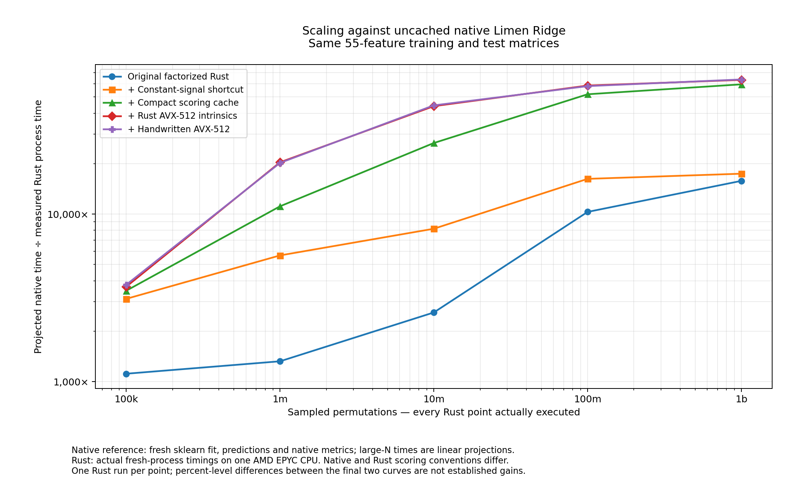

# Terasweep benchmark record

This directory is the durable Git copy of the experiment deliverables and the
Mac-side exploratory work. The runnable current implementation is at the
repository root (`src/`, `Makefile`, `data/`, `configs/`). Files inside archives
are historical snapshots, not alternate installed implementations.

## Start here

| Record | What it contains |
|---|---|
| [Scaling report](reports/terasweep_scaling_report.md) | Actual Rust runs at 100k, 1m, 10m, 100m and 1b permutations; native reference projections and their limitations. |
| [Scaling CSV](reports/terasweep_scaling_results.csv) / [JSON](reports/terasweep_scaling_results.json) | Machine-readable scaling measurements and calibrations. |
| [Reverse-funnel report](reports/terasweep_reverse_funnel_report.md) | Integrated Rust factorization, cache, intrinsics, and handwritten-assembly comparisons. |
| [Reverse-funnel JSON](reports/terasweep_reverse_funnel_results.json) | Recorded integrated-pipeline timings. |
| [Initial native comparison](reports/ridge_side_by_side_results.md) | Native Limen replay and the initial prepared-input Terasweep comparison. |
| [First cache exploration](reports/terasweep_simd_findings.md) | Profiling and validated constant-signal shortcut. |
| [Intrinsics kernel exploration](reports/avx512_kernel_report.md) | Historical C-oracle/intrinsics experiments before Rust integration. |
| [Handwritten-kernel exploration](reports/handwritten_avx512_report.md) | Standalone authored assembly versus tuned intrinsics, before full-pipeline integration. |
| [Handoff and verification](handoff/README.md) | Source identity, baseline, validation, and intentionally excluded rebuildable material. |



[Separate full-CLI reference-rate projection](reports/terasweep_scaling_full_cli_reference.png).
Neither graph turns projected native runtimes into measured large native runs.
Reports from different hosts/workloads must not be multiplied into a cumulative
speedup. Historical C probes remain for evidence; the integrated executable
uses Rust intrinsics and handwritten assembly, not a C scoring kernel.

## Complete experiment archives

| Archive | Contents |
|---|---|
| [Scaling experiment](archives/terasweep_scaling_experiment.tar.gz) | Final source snapshots, frozen inputs, all 25 large Rust runs, native calibrations, validation, plots, and replay scripts. |
| [Reverse-funnel experiment](archives/terasweep_reverse_funnel_experiment.tar.gz) | Original and integrated Rust sources, native artifacts, raw timing repetitions, checksums, disassembly, and replay scripts. |
| [Final standalone pipeline](archives/terasweep_rust_pipeline.tar.gz) | Exact delivered source snapshot, matching the current runtime source manifest. |
| [Intrinsics exploration](archives/avx512_kernel_experiment.tar.gz) | Historical C reference/intrinsics sources, inputs, measurements and disassembly. |
| [Handwritten exploration](archives/handwritten_avx512_experiment.tar.gz) | Authored assembly, comparison implementations, validation, and timing records. |
| [Original uploaded inputs](archives/inputs.tar.gz) | Original Terasweep source/data and the early bounds-shortcut prototype. |

Archives are regular Git objects, not expiring workflow artifacts or pointers to
conversation attachments. They are kept byte-identical to the delivered bundles.
Each file remains below 50 MiB. To replay, extract the desired archive into an
unused directory and follow its own README. Linux AVX-512F/BMI1 and Rust 1.89 are
required for the recorded vector paths; the Mac runs the scalar paths.
Full replay deliberately executes the long sweeps. Integrity verification below
does not rerun benchmarks.

## Mac-side history

`mac-history/` retains the original Mac executable/results, first native replay,
profiling and bounds prototypes, complete C-oracle fixture, staged integrations,
and before-state checks. [inventory.json](mac-history/inventory.json) records
source paths and per-file hashes. Compiler caches and clean Git-backed staging
worktrees are excluded explicitly; their remote commits and workflow patches
are recorded instead. The final runtime supersedes these historical prototypes.

## Verify after cloning

```sh
python3 scripts/verify_evidence.py
make verify LEVEL=compact
# On an AVX-512F/BMI1 x86-64 Linux machine with Rust >= 1.89:
make test
make verify LEVEL=intrinsics
make verify LEVEL=assembly
```

The verifier checks the full handoff checksum list, the measured source snapshot,
all archives, their embedded checksum lists, and the Mac-history member inventory.
It refuses unsafe archive paths or symlinks and never extracts files. It also
checks a small set of recognizable credential formats; this is not a guarantee
that arbitrary sensitive content is absent.

Original reports are historical evidence and have not been rewritten. Statements
in them that Git delivery or Mac transfer was incomplete describe the state at
measurement time; the [handoff record](handoff/README.md) supersedes only that
operational status, not the benchmark numbers or qualifications.
