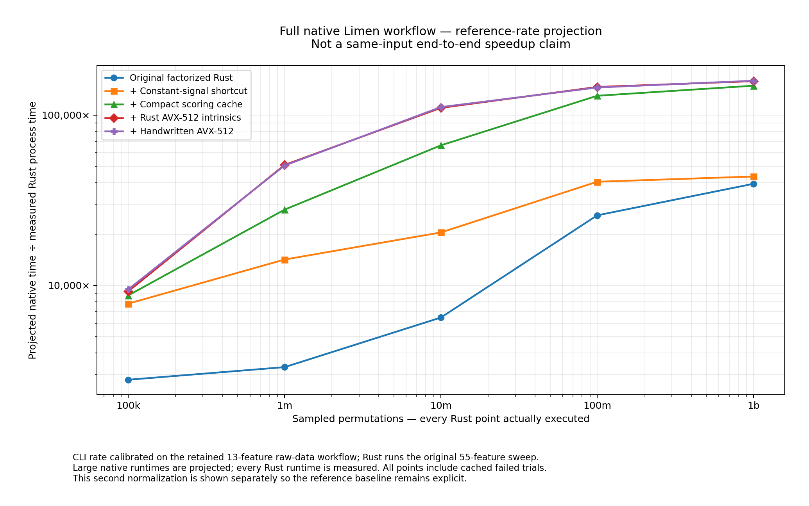

# Terasweep scaling: actual 100k–1b runs and projected native reference costs

## What was run

All five deployable stages were actually executed at each requested size: 100,000; 1,000,000; 10,000,000; 100,000,000; and 1,000,000,000 sampled permutations. That is 25 complete timed processes and 5,555,500,000 sampled row evaluations. No Rust runtime in this report is extrapolated. The earlier no-reuse/statistics-only training ablations are not billion-row benchmarks in this study. The funnel starts with the original already-factorized Rust runner and then includes every subsequent cache/SIMD/assembly level.

All runs use the unchanged original 55-feature workload: 4,136 training rows, 1,136 test rows and matching prices, seed 20260514, 384 alphas, two intercept choices, three pivot cutoffs, all six signal rules, the original threshold grids, and 13×13 fee/slippage values. The source code of both the original runner and the previously delivered optimized runner is unchanged. Each run starts a new process and empty computational caches; OS file caches were not flushed.

Host: AMD EPYC 9V74 (as reported by this x86-64 KVM VM), single-threaded and pinned to logical CPU 0. Four CPU-equivalents of quota, five visible logical CPUs, 4 GiB memory limit. Rust 1.89.0 / LLVM 20.1.7, identical `--edition=2021 -O -C panic=abort -C target-cpu=native -C lto=fat -C codegen-units=1` flags for original and optimized sources. These are newly measured values, not timings copied from the earlier Intel or M1 hosts. Timed native and Rust jobs did not overlap.

## What was inferred

Only large native-reference runtimes are inferred, under the requested linear-growth assumption. Short native calibrations were rerun on this same machine, pinned to the same CPU. There are three deliberately separate reference boundaries. They are not interchangeable.

| Reference | Measured short-run calibration | Linear slope | Intercept | Input / work boundary |
|---|---|---:|---:|---|
| Native Limen Ridge evaluation | 256 and 2,048 rows, twice each | 6.253191 ms/row | 0.120492 s | Same original 55-feature matrices; new sklearn fit, prediction, native regression/confusion/backtest metrics per row; no raw preparation or experiment artifacts |
| Bare sklearn Ridge | 256 and 2,048 rows, twice each | 3.683446 ms/row | 0.129296 s | Same original 55-feature matrices; new fit, prediction and MAE per row |
| Full native Limen CLI / UEL | 128, 512 and 1,014 rows, twice each | 15.638137 ms/row | 1.409528 s | Retained 13-feature raw-data workflow from the earlier comparison; preparation, sklearn, native metrics and artifacts |

The main same-matrix reference is `limen-prepared`. Its model is:

```text
T_Limen-prepared(N) = 0.120492103 + 0.006253190811 × N seconds
multiplier(level, N) = T_Limen-prepared(N) / measured_Rust_wall_time(level, N)
```

The full-CLI model is shown separately for continuity with the earlier full-Limen comparison. It is not a same-input end-to-end speedup claim: that CLI calibration has 13 features while the original Rust workload has 55. The prepared native Ridge and sklearn controls eliminate that matrix-size mismatch, but native and Rust still have different backtest conventions and solver failure contracts.

Native prepared calibrations reproduce the original sampled alpha/intercept/fee/slippage sequence and execute a fresh standard sklearn estimator on every iteration. They do not map `solver_eps` to sklearn `tol`, and they retain the native `prediction > 0` signal convention rather than substituting the six-rule Terasweep scorer. Thus these plotted values are explicitly **projected reference-cost multipliers**, not proof of fully equivalent end-to-end economics.

Native prepared loop timings exclude Python/import/input-loading overhead, whereas every Rust value includes its whole process. Full native CLI calibration includes the entire process. Both baselines remain uncached. Warnings are recorded rather than silently suppressed. The prepared 2,048-row samples each emitted 176 backend warnings; the CLI records its normal dataframe-interchange deprecation warning.

The inferred long native runs were not executed. Linearity at these scales is an assumption, not a measured conclusion about artifact I/O, retained memory, scheduler behavior or billion-row completion. The two prepared-native repetitions imply endpoint slopes of about 5.897 and 6.609 ms/row, illustrating calibration variability before any extrapolation uncertainty.

## Actual complete-process runtimes

One timed fresh process per cell. No timing outliers were discarded. Differences of a fraction of a percent between the last two levels are not statistically established gains.

| Sampled rows | Original Rust | + bounds | + compact cache | + Rust intrinsics | + handwritten assembly |
|---|---:|---:|---:|---:|---:|
| 100k | 0.560762 s | 0.200364 s | 0.179216 s | 0.169473 s | 0.165078 s |
| 1m | 4.725523 s | 1.103010 s | 0.561577 s | 0.306785 s | 0.309248 s |
| 10m | 24.161463 s | 7.646082 s | 2.353933 s | 1.418630 s | 1.403222 s |
| 100m | 60.676059 s | 38.525035 s | 12.046393 s | 10.690219 s | 10.771434 s |
| 1b | 396.034368 s | 358.844246 s | 105.121270 s | 98.874498 s | 98.286879 s |

## Growth of the multiplier: same-matrix native Ridge reference


| Sampled rows | Original Rust | + bounds | + compact cache | + Rust intrinsics | + handwritten assembly |
|---|---:|---:|---:|---:|---:|
| 100k | 1,115× | 3,122× | 3,490× | 3,690× | 3,789× |
| 1m | 1,323× | 5,669× | 11,135× | 20,383× | 20,221× |
| 10m | 2,588× | 8,178× | 26,565× | 44,079× | 44,563× |
| 100m | 10,306× | 16,232× | 51,909× | 58,495× | 58,053× |
| 1b | 15,790× | 17,426× | 59,485× | 63,244× | 63,622× |

## Full native CLI reference-rate projection — separate normalization

**This calibration uses the earlier 13-feature native workflow, not the original 55-feature matrices. Do not describe this table as a matched-workload end-to-end speedup.**



| Sampled rows | Original Rust | + bounds | + compact cache | + Rust intrinsics | + handwritten assembly |
|---|---:|---:|---:|---:|---:|
| 100k | 2,791× | 7,812× | 8,734× | 9,236× | 9,482× |
| 1m | 3,310× | 14,179× | 27,849× | 50,979× | 50,573× |
| 10m | 6,472× | 20,453× | 66,435× | 110,235× | 111,445× |
| 100m | 25,773× | 40,592× | 129,816× | 146,285× | 145,182× |
| 1b | 39,487× | 43,579× | 148,763× | 158,161× | 159,107× |

## One-billion-row result: three distinct denominators

| Projected reference | Inferred native time | Multiplier versus measured assembly pipeline |
|---|---:|---:|
| Bare sklearn, same matrices | 3,683,446 s (42.63 days) | 37,476× |
| Native Limen Ridge evaluation, same matrices | 6,253,191 s (72.37 days) | 63,622× |
| Full native CLI reference rate, different calibration workload | 15,638,138 s (181.00 days) | 159,107× |

The actual assembly process took **98.286879 seconds**, or **10,174,298 sampled rows/second**. The original Rust process took 396.034368 seconds. Their directly measured same-workload gain is **4.0294×**; no native projection enters that ratio.

## Why the curve grows and then flattens

The native-reference model pays approximately the same uncached evaluation cost per requested sample. Terasweep pays a fixed training-statistics/fit/prediction cost, plus the cost of newly encountered score states, plus a cheaper per-sample scheduling/cost/reduction cost. A useful structural model—not a fitted Rust timing substitute—is:

```text
T_native(N) ≈ a + b N
T_Rust(N) ≈ fixed_training + c × unique_score_states(N) + d N
```

As score-state coverage saturates, `unique_score_states(N)` stops growing, and average time per sample falls. The multiplier tends toward a ceiling set by the remaining per-row work; it does not grow indefinitely.

| Sampled rows | Unique valid base-score keys | Fraction of all valid keys encountered | Valid rows | Failed rows |
|---|---:|---:|---:|---:|
| 100k | 71,979 | 2.14% | 72,832 | 27,168 |
| 1m | 648,130 | 19.27% | 728,102 | 271,898 |
| 10m | 2,902,005 | 86.26% | 7,278,517 | 2,721,483 |
| 100m | 3,364,062 | 100.00% | 72,783,536 | 27,216,464 |
| 1b | 3,364,062 | 100.00% | 727,869,685 | 272,130,315 |

There are 2,304 configured training keys, 627 of which fail under the retained Rust pivot-cutoff convention. The 1,677 valid training keys each have 2,006 rule/threshold possibilities: `(4 × 401) + (2 × 201)`. Thus the valid score-key ceiling is exactly `1,677 × 2,006 = 3,364,062`. It is reached by 100m in this deterministic sample. Mixed states saturate at 224,178; all-off and all-on logical keys account for 1,876,590 and 1,263,294 respectively.

At 1b, about 99.54% of valid rows reuse an existing base-score key. Cached failed fits also avoid downstream scoring and remain counted in every throughput figure. No trial was dropped.

The sampler draws with replacement. The full configured Cartesian space has 781,088,256 logical combinations including failures. One billion sampled rows therefore must not be described as one billion distinct experiments or independently fitted models.

## What happens to SIMD and assembly at large N

The late-stage kernels accelerate new mixed-score computations; they do not run again for every cached sample. Once the cache is populated, sampling, table lookup, cost application and summary reduction dominate. Consequently, the intrinsic and assembly curves converge even while their advantage over the projected uncached native reference grows.

Assembly pipeline at one billion rows:

| Diagnostic phase | Time |
|---|---:|
| Training statistics / configuration | 0.005786 s |
| Fit and prediction preparation | 0.114294 s |
| Scheduling and cache lookup | 53.804768 s |
| Mixed scoring, grouping and packing | 0.336201 s |
| Cost application and result reduction | 44.015944 s |

The mixed-scoring phase is only **0.342%** of this whole process. The observed intrinsic-versus-assembly whole-run difference at 1b is only about 0.60%; a single pair does not establish that as a reproducible assembly-specific gain. The phase difference itself is only 25.86 ms.

Peak RSS at 1b is about 939.1 MiB for original Rust and 77.8 MiB for assembly. Compact cache state and the bounded row buffer prevent allocations proportional to one billion retained rows.

## Validation

All five stages have identical stable output JSON at every requested size, excluding the two original timing fields. The 1m outputs additionally match the retained canonical golden result.

After all timed native and Rust measurements ended, each SIMD path separately ran with `TERASWEEP_CHECK_BASE=1` for 100m rows. That covers the entire valid score-key universe: **3,364,062 complete BaseScores per kernel**, comparing all 17 fields, including the nine floating-point bit patterns. Both passed, as did their full stable summaries. These duplicate-oracle validation runs are not included in the timing table.

The recompiled Rust boundary suite also passed **138,240** full-BaseScore comparisons on this host. This is coverage of the retained real-data workload, its boundaries and masks, not a universal proof of every future input. No reduction in precision, tolerance relaxation or numerical-path change was introduced in this scaling study.

## Reproducibility and files

`terasweep_scaling_results.json` contains all measured rows, all three calibration models, raw calibration metadata, machine/compiler/input/executable hashes and validation records. The CSV is a flattened export of the same data. The experiment bundle retains unchanged source, input matrices, both plotting normalizations, raw stderr/stdout/resource logs, native calibration artifacts, validation output and replay scripts.

The original Mac project is not modified by this experiment. The study executes the previously delivered Rust pipeline rebuilt for the current x86 host. There is no C scoring kernel in these pipeline runs.

**Interpretation:** the earlier roughly 1,000× figure characterized a small, different native-grid comparison; it was not a ceiling on large-sweep acceleration. The actual long-run Rust curve confirms amortization and cache saturation. The native-relative large-N figures remain explicitly conditional projections, with their denominator and calculation/output differences disclosed.
